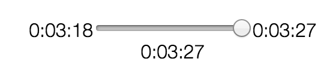

# rewindjs
A small widget that allows you to rewind time and replay events.



**Usage**:

```javascript
var myRewindExample = rewindTime('#rewind');

// Register an event
myRewindExample.registerEvent(function() {
  alert('hello world');
});

// Now rewind the range input back, and it will trigger queued events.
```

**How it works:**
The widget maintains an event map that stores a queue of events. When you call `myRewindExample.registerEvent()`, you are
pushing an event onto the event map at the current point in time. When you rewind time, every "tick" we check if there
have been events that have been stored at that point in time, and we execute them.

The eventMap uses the different in time between its initialization (1), and the current time (n) to store events.

Assuming a `tickDuration` of 1 second, if we initialize the widget, waited 4 seconds, and registered event `f()`,
the `eventMap` would contain:

```javascript
{
    "5": [f]
}
```

**Licensing**:
This widget is MIT licensed. Feel free to fork and hack away at this as much as you want (just please don't sue me :) )

